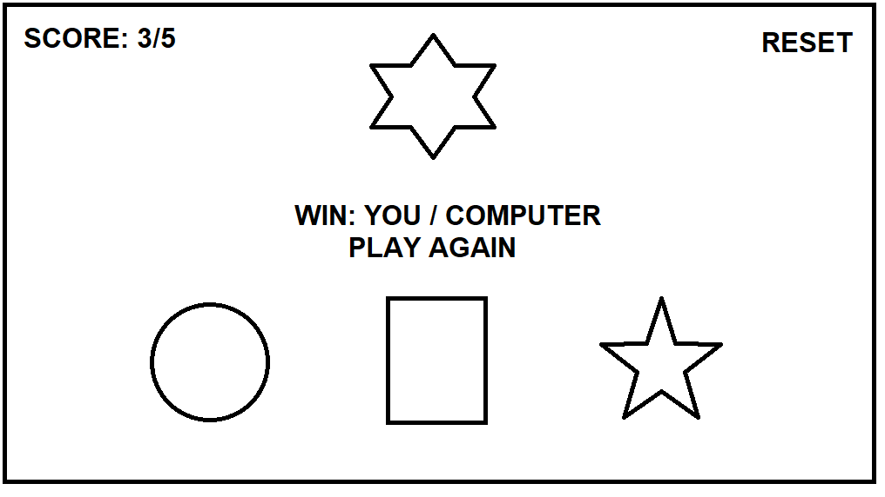
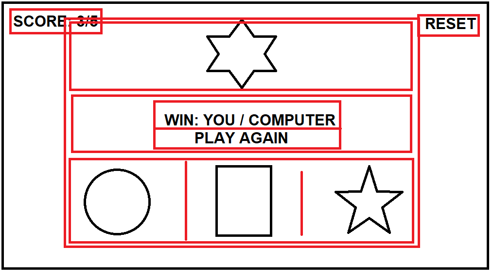
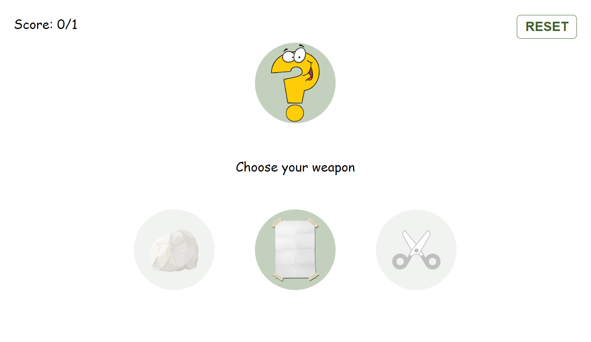
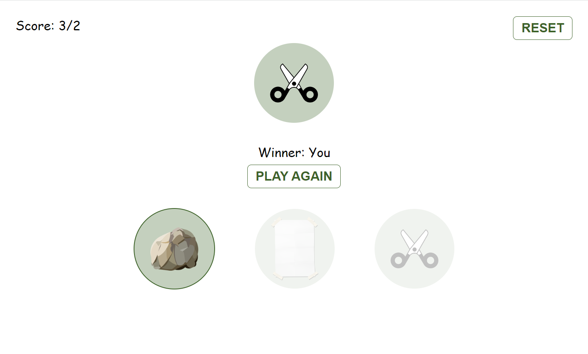

# Rock Paper and Scissors web game

A simple web game, develop by HTML, CSS (SCSS), JS  
For the nostalgic game [Rock Paper Scissors](https://he.wikipedia.org/wiki/%D7%90%D7%91%D7%9F_%D7%A0%D7%99%D7%99%D7%A8_%D7%95%D7%9E%D7%A1%D7%A4%D7%A8%D7%99%D7%99%D7%9D)

## How to play
you as a player choose one of three options: Rock, Paper and Scissors images buttons
and then, the computer choose a random as well in 2 seconds while display rotate/spin animation

and the winner is one player who chosen the bigger option:  

| Winner   |     | Looser   |
|----------|:---:|----------|
| Paper    | \>  | Rock     |    
| Rock     | \>  | Scissors |    
| Scissors | \>  | Paper    |

## How to Run
First getting the updated css styles and then run you project
(If `styles/css/styles.css` not exists)
1. run `npm install`
2. run `npm run sass`
3. open file `index.html` in your Chrome browser

Or try to play here in [Live Demo](https://hdriel.github.io/rock-paper-scissors-web/)

## Planning
This project wes planed before starting develop and the layout wes: 

After dividing into parts

The final Result is:

## Tech and Skills
Development styles with [Sass](https://sass-lang.com/) by separated into component styles  
my new approach to Keep project in [KISS](https://he.wikipedia.org/wiki/KISS) principle for highest for readability and easy maintenance
Each button control on the logic and UI updates
